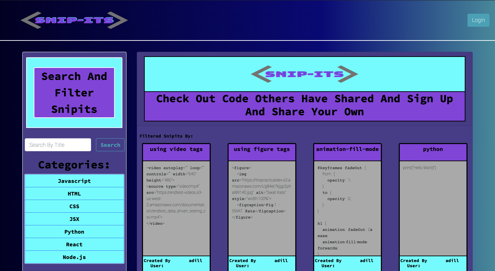

# Snipits Code Sharing App ✂️📎

   



[Link To Deployed Application (Using Heroku)](https://snip-its.herokuapp.com/)


## Description
A code sharing application built with React.js. A user can either view shared Snipits from other users on the site. Or they have the option to  sign up and log in to share their own snipits. When viewing all Snipits, a user can search through the titles of the Snipits or filter by the current catogories available.
## Table of Contents 
  - [Installation](#installation)
  - [Usage](#usage)
  - [Contributing](#contributing)
  - [Tests](#tests)
  - [Questions](#questions)
  - [License](#license)
## Installation
To install necessary dependencies, run the following command:
``` 
cd <project-repo>
npm install
```
## Usage
To run the app locally, use the command:
``` 
npm start
```
## Contributing
Contributors: Sean Kirkpatrick, Adil Hussain, Bora Xhidra, Tanasia LaBrew, Paul Toroß
## Tests
To run tests, run the following command:
```
N/A
```

## Folder Structure
```
├── _assets                <- # project management assets
├── client                 <- # front end react app                        
│   ├── README.md          <- # create react app readme
│   ├── package.json       <- # create react app dev server (hot reloading)
│   ├── public             <- # front end static files 
│   │   ├── favicon.ico
│   │   ├── index.html
│   │   └── manifest.json
│   └── src                <- # font end source (can also place static files to be packed with webpack)
│       ├── App.js         <- # 🚀 react app entry point 
│       ├── components     <- # reusable components
│       │   ├── Card
│       │   ├── DeleteBtn
│       │   ├── Form
│       │   ├── Grid
│       │   ├── Head
│       │   ├── **ProtectedRoute** <- # protected routes (HOC)
│       │   └── Table
│       ├── index.js
│       ├── pages             <- # page components
│       ├── style.css
│       └── **utils**         <- # front end utils
│           ├── API.js        <- # coments routes front end api
│           ├── useLogPath.js <- # custom hook for development - logs current path
│           └── userAPI.js    <- # user routes front end api
├────────────────────────── **☝️ client 👇 server**
├── controllers               <- # routes function
│   ├── snipitsController.js
│   └── userController.js
├── models                    <- # Schemas
│   ├── Snipit.js
│   ├── User.js
│   └── index.js
├── routes                    <- # routes (only API routes)
│   ├── api
│   │   ├── snipits.js
│   │   ├── index.js
│   │   └── user.js
│   └── index.js
├── utils                     <- # server helper functions 
│   ├── config.js             <- # global config (put anything you like)
│   ├── passport.js           <- # passport setup
│   └── seedDB.js             <- # seed script
├── package.json
├── readme.md
└── server.js                 <- # 🚀 entry point
```
## Questions
If you have any questions about the repo, open an issue or contact me directly at adilh621@gmail.com. You can find more of my work on [GitHub](https://github.com/adilh621).
## License
MIT License

Copyright (c) 2020 Snipits

Permission is hereby granted, free of charge, to any person obtaining a copy
of this software and associated documentation files (the "Software"), to deal
in the Software without restriction, including without limitation the rights
to use, copy, modify, merge, publish, distribute, sublicense, and/or sell
copies of the Software, and to permit persons to whom the Software is
furnished to do so, subject to the following conditions:

The above copyright notice and this permission notice shall be included in all
copies or substantial portions of the Software.

THE SOFTWARE IS PROVIDED "AS IS", WITHOUT WARRANTY OF ANY KIND, EXPRESS OR
IMPLIED, INCLUDING BUT NOT LIMITED TO THE WARRANTIES OF MERCHANTABILITY,
FITNESS FOR A PARTICULAR PURPOSE AND NONINFRINGEMENT. IN NO EVENT SHALL THE
AUTHORS OR COPYRIGHT HOLDERS BE LIABLE FOR ANY CLAIM, DAMAGES OR OTHER
LIABILITY, WHETHER IN AN ACTION OF CONTRACT, TORT OR OTHERWISE, ARISING FROM,
OUT OF OR IN CONNECTION WITH THE SOFTWARE OR THE USE OR OTHER DEALINGS IN THE
SOFTWARE.
